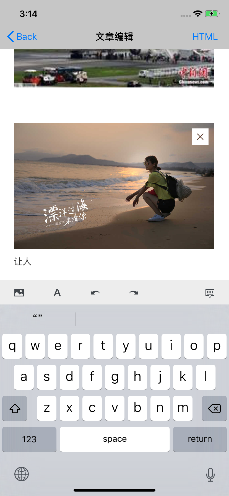

# RichTextEditor
Rich text editor, optimized WGRichTextEditor, multi-image addition, image deletion, line-feed cursor positioning, font style, etc.

Fix some bugs based on [ZSSRichTextEditor] (https://github.com/nnhubbard/ZSSRichTextEditor) and [WGEditor](https://github.com/study123456/WGEditor-mobile) and simply optimize them.

#### Partial update record:

Fix cursor failure problem: delete image and other operations cause cursor failure

Fix image sorting error issue: Asynchronous upload image sorting error

Add the delete button function in the upper right corner of the image
Fix the forbidden image area to get the cursor: The picture area setting is not editable, otherwise it will cause many bugs.

When you enter the edit page to import html, the settings containing the image are operational.

Cursor position problem when text editing is wrapped

Preloading webView (UIWebView initialization takes a long time)

#### Snapshot:

